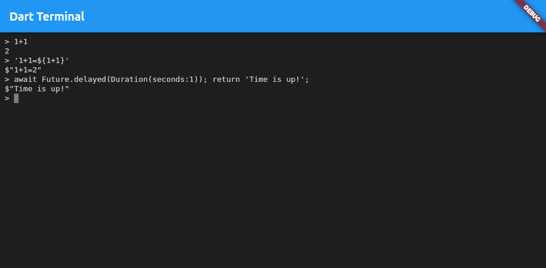

# Dartterm

A simple Dart REPL in a Flutter UI.

### [Live Demo](https://anlumo.github.io/dart_terminal/)



## Getting Started

The usual Flutter compile steps apply:

```
flutter pub get
flutter run
```

This project should run on all platforms Flutter runs on.

## Concept

There's the Flutter package [xterm](https://pub.dev/packages/xterm) that supplies a fully featured terminal emulator that's even capable of running vim and any other command line tool (when properly hooked up).

There's the Dart package [dart_eval](https://pub.dev/packages/dart_eval) that can compile Dart-like code to a bytecode at runtime and execute it.

My thoughts were, what happens when we combine them?

This is the result. I had some trouble getting a readline equivalent working, since without an underlying shell, we actually don't have anything like that and just get keyboard events. The code is based on [cli_repl](https://github.com/jathak/cli_repl), but since that code assumes that there's dart:io or dart:html behind it, I had to copy the code and adapt it.

## Features

* Can execute anything dart_eval can execute.
* Can be extended to expose extra classes via dart_eval.
* Wrote a small wrapper to allow the use of `await` directly in the command line (without a wrapping async function).
* Basic text editing with arrow keys support (no emacs shortcuts).
* History for 10 entries, can be navigated with arrow up/down.

## Limitations

Unfortunately, dart_eval does not support a lot of Dart features we would benefit from. It does not expose all std functionality (for example, `Iterable.generate`) and even basic things like `?:` and the modulo operator `%` do not work. However, I hope that this improves over time.

Also, multiline entry isn't supported right now. The text entry code would support it, but it's unclear at the moment how I could determine whether the entry is complete or not.

Further, the output is just converting whatever comes in into a string (via `toString`). It does not allow object introspection, since this is not possible in Dart. However, the type returned by dart_eval could allow for other options, I haven't looked into this yet.

Finally, the detection whether the entry should be a oneliner (arrow function) is very basic. Right now it just checks whether the last character is not a `;`. If I had a full AST of the parsed code, I could implement a better detection (such as checking whether the top level is just a single expression).

## Future Goals

The idea behind this package is that this allows embedding a command line into any Flutter application, for example as a console like in the id or Valve games (Doom, Quake, Source Engine, etc). This would enable a very flexible debugging experience, since all kinds of subsystems could be exposed to this. Still, it allows full sandboxing of the environment, if this is desired.

# LICENSE (BSD 3-Clause)

Copyright (c) 2023, Andreas Monitzer.
All rights reserved.

Redistribution and use in source and binary forms, with or without
modification, are permitted provided that the following conditions are met:

* Redistributions of source code must retain the above copyright notice, this list of conditions and the following disclaimer.
* Redistributions in binary form must reproduce the above copyright notice, this list of conditions and the following disclaimer in the documentation and/or other materials provided with the distribution.
* Neither the name of the project nor the names of its contributors may be used to endorse or promote products derived from this software without specific prior written permission.

THIS SOFTWARE IS PROVIDED BY THE COPYRIGHT HOLDERS AND CONTRIBUTORS "AS IS" AND
ANY EXPRESS OR IMPLIED WARRANTIES, INCLUDING, BUT NOT LIMITED TO, THE IMPLIED
WARRANTIES OF MERCHANTABILITY AND FITNESS FOR A PARTICULAR PURPOSE ARE
DISCLAIMED. IN NO EVENT SHALL THE COPYRIGHT HOLDER OR CONTRIBUTORS BE LIABLE FOR
ANY DIRECT, INDIRECT, INCIDENTAL, SPECIAL, EXEMPLARY, OR CONSEQUENTIAL DAMAGES
(INCLUDING, BUT NOT LIMITED TO, PROCUREMENT OF SUBSTITUTE GOODS OR SERVICES;
LOSS OF USE, DATA, OR PROFITS; OR BUSINESS INTERRUPTION) HOWEVER CAUSED AND
ON ANY THEORY OF LIABILITY, WHETHER IN CONTRACT, STRICT LIABILITY, OR TORT
(INCLUDING NEGLIGENCE OR OTHERWISE) ARISING IN ANY WAY OUT OF THE USE OF THIS
SOFTWARE, EVEN IF ADVISED OF THE POSSIBILITY OF SUCH DAMAGE.